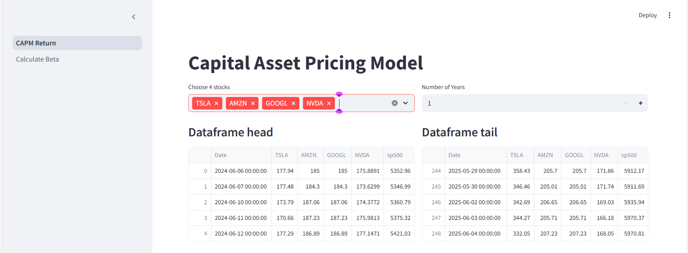
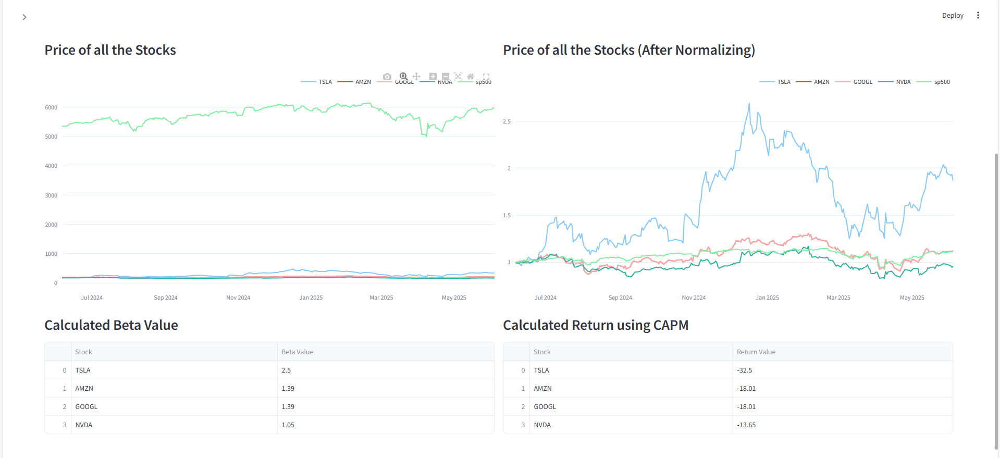
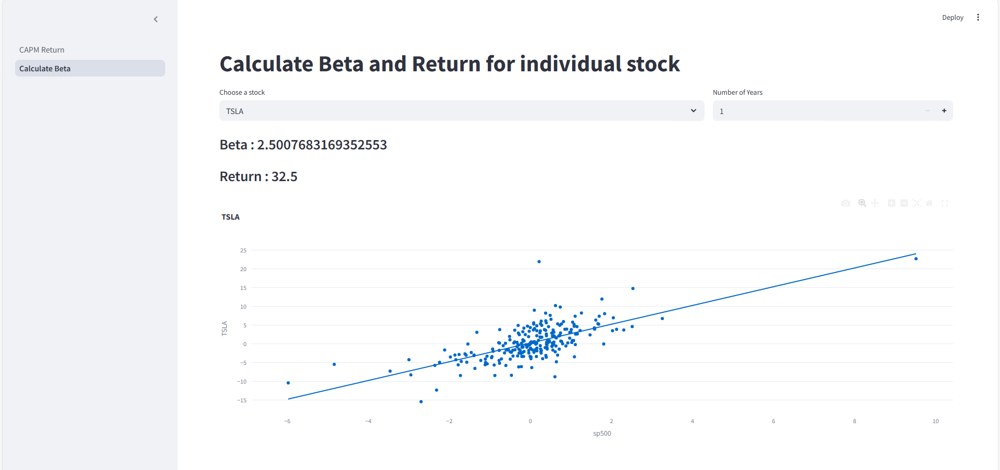

# 📈 CAPM (Capital Asset Pricing Model)

> **Widely used model for determining expected return of an asset based on its risk**  
> **Inputs:** Stock ticker symbols, number of years  
> **Outputs:** Expected return and calculated beta value of the given stock

---

## 📘 Overview

The **Capital Asset Pricing Model (CAPM)** is a financial model that describes the relationship between the expected return and the risk of investing in a security.

According to CAPM, the expected return on a security is calculated as:

\[
r_i = r_f + B_i (r_m - r_f)
\]

Where:

- \( r_i \): Expected return on a security  
- \( r_f \): Risk-free rate of return  
- \( B_i \): Beta of the stock relative to the market  
- \( r_m \): Expected return of the market  

---

## 💡 Key Concepts

### 🔹 Risk-Free Asset Return

- A typical risk-free asset is a **US Government 10-year Treasury Bill**.
- **Risk-averse investors** often prefer risk-free assets, accepting lower returns for safety.
- To **gain higher returns**, investors must take on more risk compared to the risk-free asset.

### 🔹 Market Portfolio Return

- Represents the **overall market**, typically approximated by the **S&P 500 index**.
- Market portfolio includes **all market securities**.
- Return is measured as the **average return** of the S&P 500.

---

### 🔹 Beta (β)

Beta is a measure of how a stock moves **relative to the market**. It quantifies **market sensitivity**.

| Beta Value | Interpretation |
|------------|----------------|
| β = 0      | No Market Sensitivity |
| β < 1      | Low Market Sensitivity |
| β = 1      | Same as Market (Neutral) |
| β > 1      | High Market Sensitivity |
| β < 0      | Negative Market Sensitivity |

---

## 🧪 Application Screenshots

### 1. CAPM Return Calculator Page

---

### 2. Risk-Free & Market Return Explanation Page

---

### 3. Beta Sensitivity Explanation Page

---
